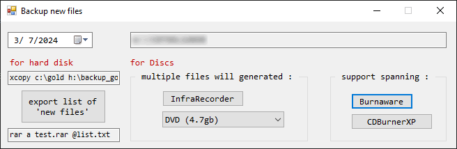

# Backup new files

This application made in a day, the purpose is to **separate** the new files from the **date defined** by the user for the given **folder**.  

In detail, the primary goal was to export a **preset file** to be imported to Nero (after contact support there is not for public (aka generate **.nri** or **.nru**), told me to use [neroCMD](https://comp.publish.cdrom.software.narkive.com/57j2MXcU/nerocmd-and-multiple-files)).  

Preset file (or compilation), means a file that contains only the filepath of the files and nothing else.  

Afterwards, found this good looking [application](https://hcidesign.com/dvdspan/) you can go till **7 discs** (because of trial) but <ins>lacks of date set</ins>.  

The day after, develop this application, supports the following export types :  
* [Burnaware](https://www.burnaware.com/) - natively supports disk spanning (you can use it as full for 7 days, then reinstall windows, I made your day ah?)
* [CDBurnerXP](https://cdburnerxp.se/) - natively supports disk spanning
* [InfraRecorder](http://infrarecorder.org/) - does not support spanning, but this applicaiton will export multiple preset files for you!
* plain text file to be used for hard disk backup with RAR or 7zip.  
  

  

---

have to inform you for **hard disk** to **hard disk**, this command doing the job well (without the need of any 3rd party application) :

```csharp
// http://answers.google.com/answers/threadview/id/95707.html
xcopy c:\gold h:\backup_gold /s/e/d
```

for archives the following found and working :  
```csharp
// https://superuser.com/a/641698
rar a test.rar @filelist.txt //supports also folder structure
7z a test.zip @filelist.txt //as is not supporting folder structure but for sure playing with the switches will
```

---

reference :  
* https://en.wikipedia.org/wiki/Disc_spanning

---
&nbsp;
## This project is no longer maintained
Copyright (c) 2024 [PipisCrew](http://pipiscrew.com)

Licensed under the [MIT license](http://www.opensource.org/licenses/mit-license.php).